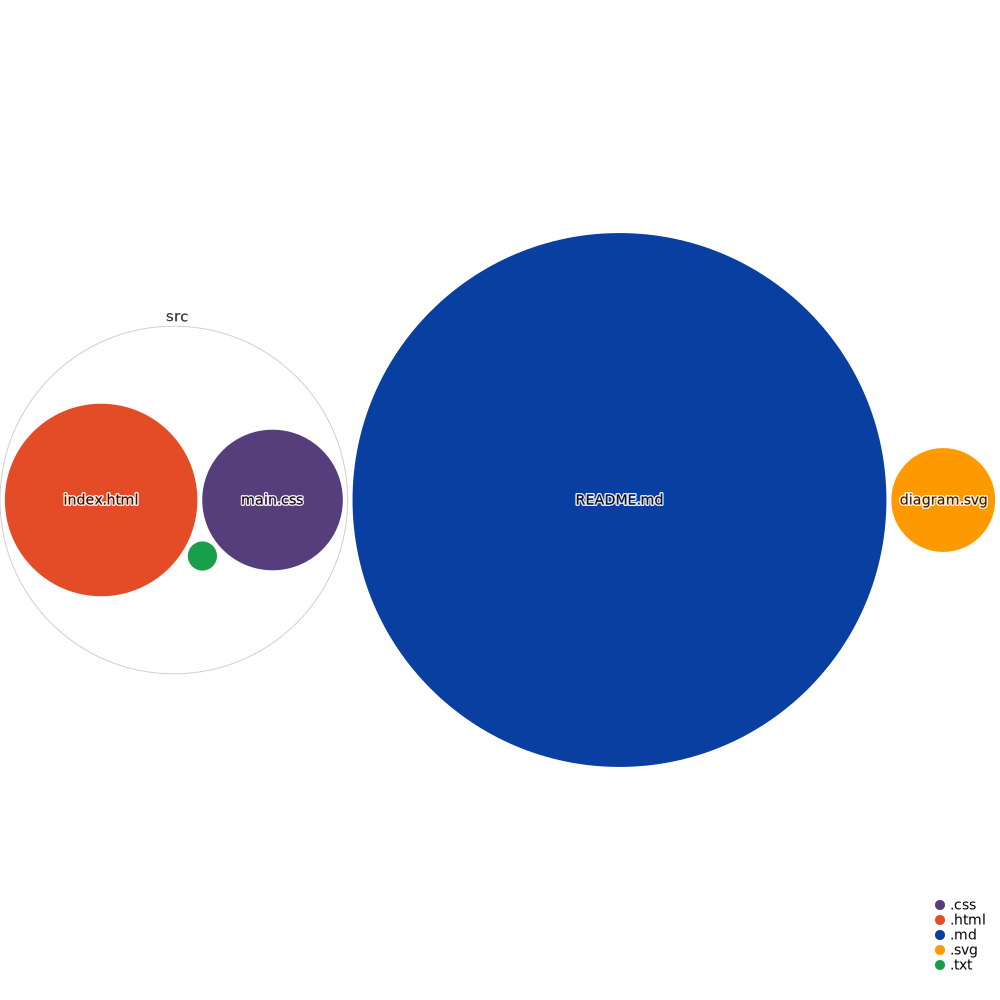

## Badges

Add badges from somewhere like: [shields.io](https://shields.io/)

[](https://github.com/tterb/atomic-design-ui/blob/master/LICENSEs)
[](https://opensource.org/licenses/)
[](http://www.gnu.org/licenses/agpl-3.0)

  


    
# Project Title

A brief description of what this project does and who it's for


## Demo

Insert gif or link to demo

  
## Documentation

[Documentation](https://linktodocumentation)

  
## Tech Stack

**Client:** React, Redux, TailwindCSS

**Server:** Node, Express


  
## Features

- Light/dark mode toggle
- Live previews
- Fullscreen mode
- Cross platform

  
## Run Locally

Clone the project

```bash
  git clone https://link-to-project
```

Go to the project directory

```bash
  cd my-project
```

Install dependencies

```bash
  npm install
```

Start the server

```bash
  npm run start
```

  
## Installation

Install my-project with npm

```bash
  npm install my-project
  cd my-project
```
    
## Usage/Examples

```javascript
import Component from 'my-project'

function App() {
  return <Component />
}
```

  
## Deployment

To deploy this project run

```bash
  npm run deploy
```

  
## Contributing

Contributions are always welcome!

See `contributing.md` for ways to get started.

Please adhere to this project's `code of conduct`.

  
## License

[MIT](https://choosealicense.com/licenses/mit/)

  
## Screenshots


  
## Support

For support, email fake@fake.com or join our Slack channel.

  
## Lessons Learned

What did you learn while building this project? What challenges did you face and how did you overcome them?

  
## Feedback

If you have any feedback, please reach out to us at fake@fake.com

  
## Acknowledgements

 - [Awesome Readme Templates](https://awesomeopensource.com/project/elangosundar/awesome-README-templates)
 - [Awesome README](https://github.com/matiassingers/awesome-readme)
 - [How to write a Good readme](https://bulldogjob.com/news/449-how-to-write-a-good-readme-for-your-github-project)

 - [readme.so](https://github.com/octokatherine/readme.so)

 - [Repo Visualizer](https://github.com/githubocto/repo-visualizer)
  
## Authors

- [@Dexters-Hub](https://github.com/Dexters-Hub)


## FAQ

#### Question 1

Answer 1

#### Question 2

Answer 2

  